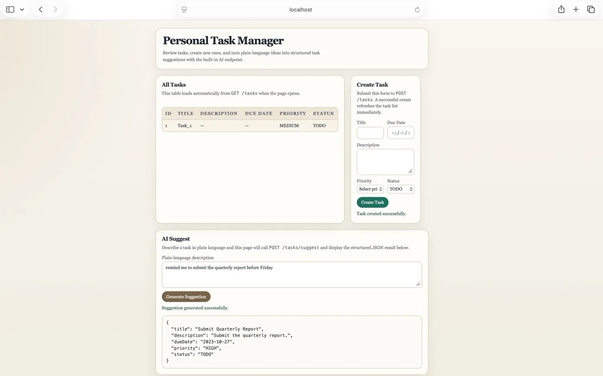

# Personal Task Manager

## Preview


## Overview

Personal Task Manager is a Spring Boot REST API for managing personal tasks with full CRUD functionality and an AI-powered endpoint that converts plain-language descriptions into structured task suggestions using the Gemini API. It also includes a minimal frontend served at [http://localhost:8080](http://localhost:8080).

## Prerequisites

- Java 17
- Internet access for Maven dependencies on first run
- A free Gemini API key from [aistudio.google.com](https://aistudio.google.com)

## Setup and Running

```bash
git clone <your-repo-url>
cd personal-task-manager
export GEMINI_API_KEY=your_api_key_here
./mvnw spring-boot:run
```

Open [http://localhost:8080](http://localhost:8080) in your browser.

Note: the app starts cleanly without a key but the AI endpoint will return an error if called without one.

## Running Tests

```bash
./mvnw test
```

All 17 tests pass. No Gemini API key required — the AI call is mocked in tests.

## API Endpoints

| Method | Path | Description |
|--------|------|-------------|
| POST | `/tasks` | Create a new task |
| GET | `/tasks` | List all tasks |
| GET | `/tasks/{id}` | Get a single task by ID |
| PUT | `/tasks/{id}` | Update an existing task |
| DELETE | `/tasks/{id}` | Delete a task |
| POST | `/tasks/suggest` | Generate a structured task suggestion from plain language |

## AI-Powered Endpoint

`POST /tasks/suggest` accepts a plain-language description, calls Gemini-2.5-Flash-lite, and returns structured task JSON without persisting anything to the database.

Example request:

```json
{
  "description": "remind me to submit the quarterly report before Friday"
}
```

Example response:

```json
{
  "title": "Submit quarterly report",
  "description": "Prepare and submit the Q3 report before the deadline",
  "dueDate": "2026-05-16",
  "priority": "HIGH",
  "status": "TODO"
}
```

## Tech Stack

- Java 17
- Spring Boot 3.3.5
- Spring Data JPA
- H2 in-memory database
- Gemini 2.5 Flash Lite API
- Maven
